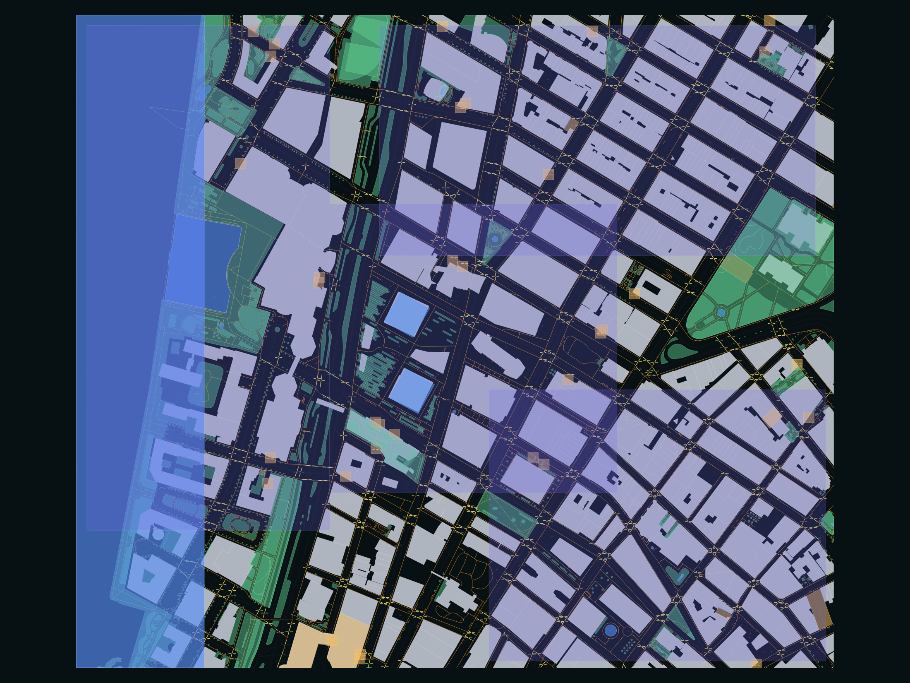
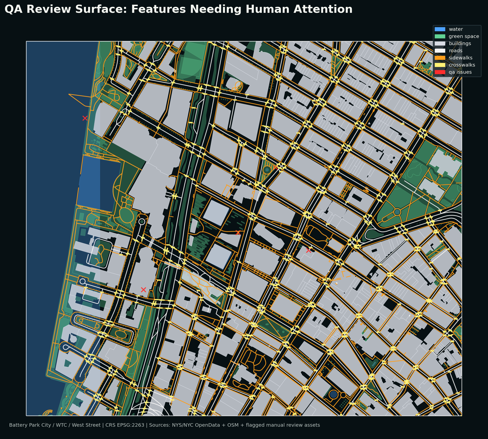
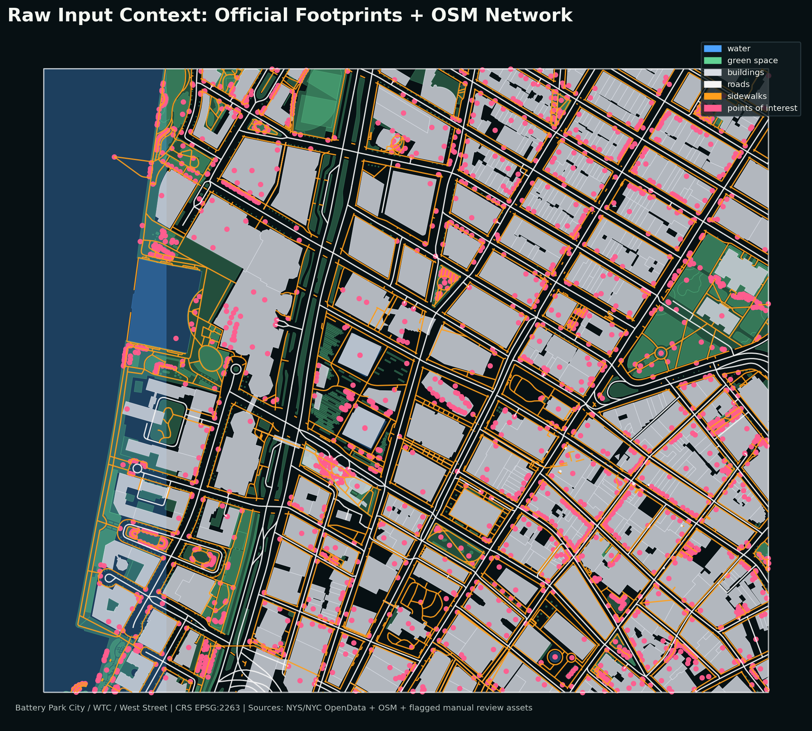
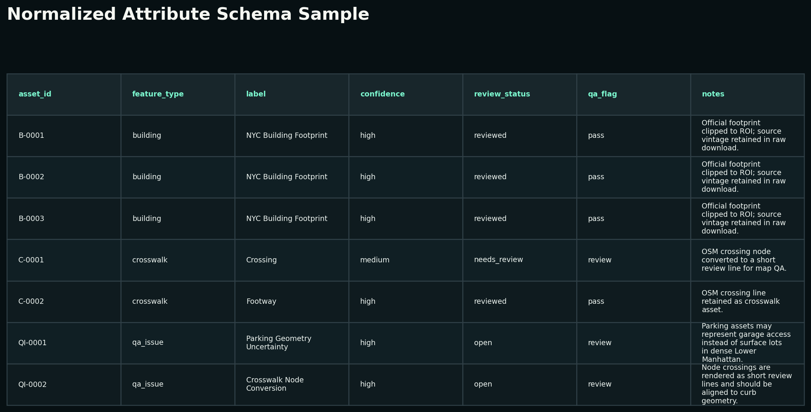
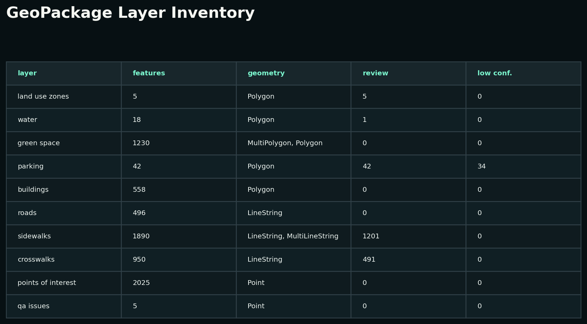

# AI-Ready Lower Manhattan Geospatial Assets

Production-style QGIS portfolio project for AI geospatial data QA, annotation review, and GIS workflow evaluation.



## Why This Exists

The target role is a QGIS-focused AI trainer/evaluator role: create GIS tasks, review AI answers for correctness, and give precise feedback on geospatial workflows. This project is built to show that skill directly. It is not a pretty-map-only portfolio piece; it is a compact asset production pipeline with labeled layers, consistent attributes, review flags, exports, QA notes, and example AI-evaluation tasks.

Study area: **Battery Park City / World Trade Center / West Street, Lower Manhattan**.

Working CRS: **EPSG:2263**  
Web/export CRS: **EPSG:4326**  
QGIS version used: **3.44.10-Solothurn**

## Deliverables

- QGIS project: [`qgis/lower_manhattan_ai_assets.qgz`](qgis/lower_manhattan_ai_assets.qgz)
- GeoPackage: [`data/processed/lower_manhattan_ai_assets.gpkg`](data/processed/lower_manhattan_ai_assets.gpkg)
- GeoJSON exports: [`exports/geojson/`](exports/geojson/)
- QA report: [`docs/qa_report.md`](docs/qa_report.md)
- Data dictionary: [`docs/data_dictionary.md`](docs/data_dictionary.md)
- Labeling guide: [`docs/labeling_guide.md`](docs/labeling_guide.md)
- Source and license notes: [`docs/source_notes.md`](docs/source_notes.md)
- AI trainer task bank: [`docs/ai_trainer_task_bank.md`](docs/ai_trainer_task_bank.md)
- Map exports and screenshots: [`screenshots/`](screenshots/) and [`maps/`](maps/)

## Asset Layers

| Layer | Purpose |
|---|---|
| `buildings` | Official NYC/NYS building footprint polygons clipped to the ROI. |
| `roads` | OSM road centerline context for network and spatial reasoning tasks. |
| `sidewalks` | OSM pedestrian/footway geometries, with incomplete sidewalk coverage flagged for review. |
| `crosswalks` | OSM crossing lines plus crossing-node review markers converted to short line features. |
| `parking` | Parking assets and garage/parking access candidates, intentionally flagged for review. |
| `green_space` | Park, garden, and open-space polygons. |
| `water` | Water features, including a generalized Hudson River review boundary. |
| `points_of_interest` | OSM POIs normalized to point assets. |
| `land_use_zones` | Portfolio-scale generalized land-use labels for AI annotation workflow demonstration. |
| `qa_issues` | Explicit QA review points and issue notes. |

All production layers share this common schema:

`asset_id`, `feature_type`, `label`, `source`, `source_id`, `confidence`, `review_status`, `qa_flag`, `notes`, `last_updated`

## QA Snapshot

Generated on 2026-05-15.

- Total normalized features: **7,219**
- Features requiring human review: **1,740**
- Low-confidence review features: **34**
- Invalid geometries after normalization: **0**

The point is not to hide ambiguity. The point is to expose it cleanly through `confidence`, `review_status`, `qa_flag`, and documented notes so downstream AI/data workflows know what can be trusted immediately and what needs human review.



## Reproduce

This project uses the QGIS app-bundled Python environment on macOS.

```bash
export PROJ_LIB=/Applications/QGIS.app/Contents/Resources/qgis/proj
export PROJ_DATA=/Applications/QGIS.app/Contents/Resources/qgis/proj
export GDAL_DATA=/Applications/QGIS.app/Contents/Resources/qgis/gdal
export QGIS_PREFIX_PATH=/Applications/QGIS.app/Contents/MacOS

/Applications/QGIS.app/Contents/MacOS/python scripts/build_assets.py
/Applications/QGIS.app/Contents/MacOS/python scripts/create_qgis_project.py
```

Validate the GeoPackage:

```bash
/Applications/QGIS.app/Contents/MacOS/ogrinfo -so data/processed/lower_manhattan_ai_assets.gpkg
```

## Portfolio Screenshots







## Sources

Primary sources are public NYC/NYS building footprint data and OpenStreetMap context downloaded through Overpass API. Manual review features are explicitly marked as such. See [`docs/source_notes.md`](docs/source_notes.md) for source, license, and limitation notes.
